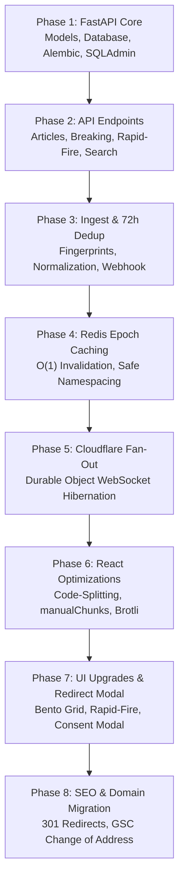

# The Daily Newzlet (v2) — Architectural Redesign & Migration Blueprint

> **Status:** Approved Architectural Blueprint  
> **Document Target:** `Docs/FUTURE_PLAN.md`  
> **Target Tech Stack:** React 19 (Vite 8 Optimized SPA) • Cloudflare Pages • FastAPI (Async) • SQLAlchemy 2.0 • Supabase PostgreSQL • Upstash Redis (Epoch Cache) • Cloudflare Durable Objects (WebSocket Hibernation) • n8n + Firecrawl AI

---

## Table of Contents

1. [Executive Summary & Motivation](#1-executive-summary--motivation)
2. [High-Level Architecture & System Design](#2-high-level-architecture--system-design)
3. [Answers to Architectural Decisions & Key Features](#3-answers-to-architectural-decisions--key-features)
   - [3.1 Google SEO & Dual-Domain Migration Explained](#31-google-seo--dual-domain-migration-explained)
   - [3.2 Epoch-Based Redis Cache Invalidation Explained](#32-epoch-based-redis-cache-invalidation-explained)
   - [3.3 Real-Time Fan-Out: Why Cloudflare Durable Objects over HiveMQ/MQTT](#33-real-time-fan-out-why-cloudflare-durable-objects-over-hivemqmqtt)
   - [3.4 Rapid-Fire Persistence & 72-Hour Deduplication Mechanics](#34-rapid-fire-persistence--72-hour-deduplication-mechanics)
   - [3.5 Breaking News Endpoint Clarification](#35-breaking-news-endpoint-clarification)
   - [3.6 Third-Party External Redirect Consent Modal](#36-third-party-external-redirect-consent-modal)
4. [Backend Architecture (FastAPI + Async SQLAlchemy 2.0)](#4-backend-architecture-fastapi--async-sqlalchemy-20)
   - [4.1 Directory Structure](#41-directory-structure)
   - [4.2 Database Models & Alembic Schema](#42-database-models--alembic-schema)
   - [4.3 SQLAdmin CRM Implementation](#43-sqladmin-crm-implementation)
   - [4.4 Ingestion Service & 72-Hour Dedup Engine](#44-ingestion-service--72-hour-dedup-engine)
   - [4.5 Redis Epoch Cache Service](#45-redis-epoch-cache-service)
   - [4.6 API Endpoints Specification](#46-api-endpoints-specification)
5. [Real-Time Fan-Out Layer (Cloudflare Durable Objects)](#5-real-time-fan-out-layer-cloudflare-durable-objects)
   - [5.1 Cloudflare Worker & Durable Object Code](#51-cloudflare-worker--durable-object-code)
   - [5.2 FastAPI Broadcast Trigger](#52-fastapi-broadcast-trigger)
   - [5.3 Client-Side React Integration Hook](#53-client-side-react-integration-hook)
6. [Frontend Architecture & Optimizations (React 19 + Vite 8 SPA)](#6-frontend-architecture--optimizations-react-19--vite-8-spa)
   - [6.1 Route-Based Code Splitting (`React.lazy` + `Suspense`)](#61-route-based-code-splitting-reactlazy--suspense)
   - [6.2 Vite Vendor Chunking (`manualChunks`) & Long-Term Caching](#62-vite-vendor-chunking-manualchunks--long-term-caching)
   - [6.3 Build-Time Pre-Compression (Brotli + Gzip)](#63-build-time-pre-compression-brotli--gzip)
   - [6.4 High-Impact Image Payload Tuning (`wsrv.nl` WebP/AVIF)](#64-high-impact-image-payload-tuning-wsrvnl-webpavif)
   - [6.5 DOM Virtualization via Modern CSS (`content-visibility: auto`)](#65-dom-virtualization-via-modern-css-content-visibility-auto)
   - [6.6 TanStack Query Cache Strategy](#66-tanstack-query-cache-strategy)
   - [6.7 External Redirection Consent Modal Component & Hook](#67-external-redirection-consent-modal-component--hook)
   - [6.8 UI/UX Redesign: News Cards, Rapid-Fire Section & Bento Grid](#68-uiux-redesign-news-cards-rapid-fire-section--bento-grid)
7. [Comprehensive Domain Migration & SEO Playbook](#7-comprehensive-domain-migration--seo-playbook)
8. [Step-by-Step Implementation Roadmap](#8-step-by-step-implementation-roadmap)
9. [Verification & Testing Strategy](#9-verification--testing-strategy)

---

## 1. Executive Summary & Motivation

**The Daily Newzlet (v1)** is an automated news aggregation platform built on React 19 (Vite SPA) on Cloudflare Pages, Django REST Framework (DRF) hosted on AlwaysData, Supabase PostgreSQL, and Upstash Redis.

While v1 functions reliably, v2 undertakes a comprehensive architectural upgrade centered on:

1. **React 19 + Vite 8 with High-Efficiency Performance Optimizations**:
   - Retains the lightweight, battle-tested React SPA architecture without the server complexity of SSR/Next.js.
   - Drastically cuts initial bundle size and mobile data transfer via route-level lazy loading, Vite vendor chunk splitting, build-time Brotli/Gzip pre-compression, and `wsrv.nl` modern image formatting.
   - Implements modern CSS offscreen rendering (`content-visibility: auto`) to render hundreds of news cards with zero UI lag.
2. **Third-Party External Redirection Consent Modal**:
   - Implements a privacy-first interstitial disclosure before sending users off-site to external news publications (e.g. YouTube, Reuters, BBC, TechCrunch), clarifying data transfer under third-party terms with an optional "Remember my choice" toggle.
3. **FastAPI with Async SQLAlchemy 2.0**:
   - Replaces Django's synchronous WSGI runtime with an asynchronous ASGI architecture.
   - Native Pydantic v2 data validation, OpenAPI docs generation, lower memory footprint, and high-concurrency request handling on AlwaysData.
4. **Hybrid Ingestion Pipeline**:
   - **Daily 5:00 AM Major Ingest**: Traditional RSS feeds curated by n8n.
   - **Every 4 Hours Minor Rapid-Fire Ingest**: Firecrawl Web Search + AI agent (in n8n) targeting breaking topics, tech developments, and world headlines.
   - **72-Hour Rolling Deduplication**: Ingest fingerprints prevent duplicate stories within a 3-day window while preserving articles permanently.
5. **Edge Fan-Out Real-Time Updates (Cloudflare Durable Objects)**:
   - Deprecates client-side 3-minute HTTP polling (`/api/news-version/`).
   - Replaces polling with WebSocket connections managed by Cloudflare Durable Objects using the **WebSocket Hibernation API**, achieving zero idle CPU consumption and instantaneous article push notifications to all active browsers.
6. **Safe Epoch-Based Redis Cache Invalidation**:
   - Prevents destructive `FLUSHALL`/`FLUSHDB` calls on shared Upstash Redis instances.
   - Utilizes atomic integer versioning (`INCR newzlet:epoch`) for O(1) instant cache invalidation without touching other databases or keys.
7. **Managed Domain Migration**:
   - Safe migration path from `newzlet.me` to `newzlet.dpdns.org` preserving SEO equity via 301 redirects and Google Search Console (GSC) Change of Address.

---

## 2. High-Level Architecture & System Design

```
                     ┌──────────────────────────────────────────────────────────┐
                     │                   INGESTION PIPELINE                     │
                     │                                                          │
                     │  [RSS Feeds (Daily 5 AM)]   [Firecrawl AI (Every 4h)]    │
                     │             │                           │                │
                     │             └─────────────┬─────────────┘                │
                     │                           ▼                              │
                     │                   [n8n Workflow]                         │
                     │                           │ (Signed Webhook POST)        │
                     └───────────────────────────┼──────────────────────────────┘
                                                 │
                                                 ▼
┌──────────────────────────────────────────────────────────────────────────────────────────┐
│                               FASTAPI BACKEND (AlwaysData)                               │
│                                                                                          │
│  [Ingest Router]                                                                         │
│         │                                                                                │
│         ├── 1. Atomic Prune Fingerprints (> 72h)                                         │
│         ├── 2. Normalized Title & URL Deduplication Check                                │
│         ├── 3. Bulk Insert New Articles & New Fingerprints                               │
│         │        │                                                                       │
│         │        ▼                                                                       │
│         │   [Supabase PostgreSQL]                                                        │
│         │   • articles (permanent)                                                       │
│         │   • news_title_fingerprints (rolling 72h window)                               │
│         │   • categories                                                                 │
│         │                                                                                │
│         ├── 4. INCR newzlet:epoch (O(1) instant cache invalidation)                      │
│         │        │                                                                       │
│         │        ▼                                                                       │
│         │   [Upstash Redis]                                                              │
│         │   • newzlet:epoch                                                              │
│         │   • newzlet:cache:e{N}:*                                                       │
│         │                                                                                │
│         └── 5. Dispatch Event: POST /broadcast to CF Worker                              │
└────────────────────────────────────────┼─────────────────────────────────────────────────┘
                                         │
                                         ▼
┌──────────────────────────────────────────────────────────────────────────────────────────┐
│                         REAL-TIME FAN-OUT (Cloudflare Edge)                              │
│                                                                                          │
│  [Cloudflare Worker]                                                                     │
│         │                                                                                │
│         ▼                                                                                │
│  [Durable Object: NewsRoom (WebSocket Hibernation API)]                                  │
│         │                                                                                │
│         ├── Broadcast { event: "NEWS_UPDATE", count: N, section: "rapid-fire" }          │
│         │                                                                                │
│         └──► [Browser Client 1]  [Browser Client 2]  [Browser Client N] ...              │
│               (Hibernating WebSockets — 0 CPU cost when idle)                            │
└────────────────────────────────────────┬─────────────────────────────────────────────────┘
                                         │
                                         ▼ (Triggers TanStack Query Invalidation)
┌──────────────────────────────────────────────────────────────────────────────────────────┐
│                     FRONTEND (React 19 + Vite 8 SPA on Cloudflare Pages)                 │
│                                                                                          │
│  • High-Efficiency Bundling: manualChunks vendor separation + Brotli compression         │
│  • Route Code-Splitting: React.lazy() for non-homepage pages (~40% smaller entry)        │
│  • Edge Image Optimization: wsrv.nl WebP/AVIF formatting with responsive srcset          │
│  • CSS content-visibility: auto for instantaneous smooth scrolling                       │
│  • External Redirection Consent Modal: Interstitial disclaimer before visiting sources   │
│  • Real-Time Updates: useRealtime() hook invalidates TanStack cache on WebSocket push    │
└──────────────────────────────────────────────────────────────────────────────────────────┘
```

---

## 3. Answers to Architectural Decisions & Key Features

### 3.1 Google SEO & Dual-Domain Migration Explained

#### The Question:
> *"But Google hates having the same site under different domains?"*

#### The Technical Reality:
Yes, Google strictly penalizes **duplicate content** if two separate domains concurrently serve the exact same live website returning `HTTP 200 OK` without canonicalization or redirection. In that bad scenario, search crawlers do not know which domain is authoritative, splitting PageRank and hurting rankings.

#### How Official Domain Migration Works (Without Penalty):
Under Google's official site migration specification:
1. **At no point are both domains serving live duplicate content.**
2. `newzlet.me` is converted into a **100% 301 Redirect Gateway**. Every request hitting `newzlet.me/any/path` receives an immediate `HTTP 301 Moved Permanently` pointing to `https://newzlet.dpdns.org/any/path`.
3. `newzlet.dpdns.org` is the **only domain serving 200 OK content**, and all its `<link rel="canonical">` tags point to `https://newzlet.dpdns.org/...`.
4. **Why Google Search Console requires verifying both domains:**
   - To use Google's official **"Change of Address"** tool, Google **requires proof of ownership for both the source property (`newzlet.me`) and the destination property (`newzlet.dpdns.org`)**. This is a security safeguard so third parties cannot hijack another website's search traffic.
   - Once verified, you submit the Change of Address in GSC. Google validates your 301 redirects, recognizes that the site has intentionally relocated, transfers your search index signals, backlinks, and keyword rankings to `newzlet.dpdns.org`, and updates the search result listings over 2 to 4 weeks.

```
❌ WRONG (Duplicate Content Penalty):
newzlet.me/article/1        --> 200 OK (Full HTML) ──┐ Google sees duplicate
newzlet.dpdns.org/article/1  --> 200 OK (Full HTML) ──┘ content -> Split rankings & PENALTY!

✅ RIGHT (Official GSC 301 Migration):
newzlet.me/article/1        --> 301 Moved Permanently (Location: newzlet.dpdns.org/article/1)
                                      │
                                      ▼
newzlet.dpdns.org/article/1  --> 200 OK (Canonical: newzlet.dpdns.org/article/1)
+ GSC Change of Address submitted (Transfers 100% link equity, NO penalty)
```

---

### 3.2 Epoch-Based Redis Cache Invalidation Explained

#### The Problem:
Upstash Redis is shared across multiple personal projects. Standard cache libraries invoke `cache.clear()` which executes `FLUSHALL` or `FLUSHDB`, instantly destroying data, queues, and caches of every other application sharing that Redis database.

#### The Solution: Atomic Epoch Versioning
Every cache key belonging to Newzlet is tagged with an integer version ("epoch") stored at Redis key `newzlet:epoch`:

```text
Key schema: newzlet:cache:e{epoch}:{route_or_query}
Example:    newzlet:cache:e42:articles:page:1
```

```
┌────────────────────────────────────────────────────────────────────────┐
│ Current state: newzlet:epoch = 42                                      │
│ Cached keys:                                                           │
│   newzlet:cache:e42:articles:page:1  (TTL 12h)                         │
│   newzlet:cache:e42:breaking          (TTL 5m)                         │
│   other_project:session:xyz          (NEVER TOUCHED)                   │
└───────────────────────────────────┬────────────────────────────────────┘
                                    │
                         n8n Ingest completes
                                    │
                                    ▼
┌────────────────────────────────────────────────────────────────────────┐
│ FastAPI executes: redis.incr("newzlet:epoch")                          │
│ New state:        newzlet:epoch = 43                                   │
│                                                                        │
│ Next incoming request reads epoch = 43:                                │
│   Looks for: newzlet:cache:e43:articles:page:1                         │
│   -> Cache Miss! Fetches DB, computes response, writes to e43 key.     │
│                                                                        │
│ What happens to e42 keys?                                              │
│   They are completely orphaned. Nothing ever reads them.               │
│   They expire silently and automatically via their 12h TTL.            │
│   Zero key scanning. Zero deletion locks. 100% O(1) instant operation. │
└────────────────────────────────────────────────────────────────────────┘
```

---

### 3.3 Real-Time Fan-Out: Why Cloudflare Durable Objects over HiveMQ/MQTT

#### The Problem with HiveMQ / External MQTT:
Serverless edge platforms like Cloudflare Workers cannot keep persistent outbound TCP socket connections open to third-party MQTT brokers (like HiveMQ Cloud) across client requests. A traditional MQTT broker requires long-lived stateful processes, defeating serverless scalability and incurring extra hosting/tier costs.

#### Why Cloudflare Durable Objects (Option A) is Superior:
1. **Edge Native**: Durable Objects run directly inside Cloudflare's global edge network.
2. **WebSocket Hibernation API**:
   - A client browser establishes a WebSocket directly with Cloudflare Edge (`wss://realtime.newzlet.dpdns.org/ws`).
   - The Durable Object "accepts" the WebSocket and puts it to sleep (hibernation).
   - **Hibernating WebSockets incur $0 in CPU and active memory costs while idle.** Cloudflare wakes the Durable Object only when a message is dispatched or received.
3. **Single HTTP POST from FastAPI**:
   - When n8n ingests new articles into FastAPI, FastAPI issues a single authenticated HTTP `POST /broadcast` to the Cloudflare Worker.
   - The Durable Object wakes up, retrieves all hibernating sockets via `state.getWebSockets("all-clients")`, loops through them to call `ws.send()`, and immediately goes back to sleep.
4. **Redis decoupled from real-time path**: Redis is used strictly as a fast response cache; it does not need to handle Pub/Sub or manage WebSocket connection state.

---

### 3.4 Rapid-Fire Persistence & 72-Hour Deduplication Mechanics

- **Articles are permanent**: All ingested articles—whether from the daily 5 AM RSS batch or the 4-hour Firecrawl rapid-fire batch—are stored permanently in the `articles` table in Supabase PostgreSQL. They are never deleted after 72 hours.
- **`is_rapid_fire` flag**: Articles coming from the Firecrawl AI workflow have `is_rapid_fire = True` (or category slug `rapid-fire`), allowing them to appear in the dedicated Rapid-Fire live ticker as well as regular archive feeds.
- **The 72-Hour Window applies ONLY to Deduplication (`news_title_fingerprints`)**:
  - To prevent Firecrawl from re-posting the same trending story every 4 hours, titles are normalized (punctuation removed, common publisher tags like `- BBC News` or `| Reuters` stripped, lowercase) and saved in `news_title_fingerprints`.
  - During every ingest, fingerprints with `created_at < NOW() - INTERVAL '72 hours'` are atomically purged.
  - If a topic has not been seen in the last 72 hours, it passes the deduplication filter and is published.

---

### 3.5 Breaking News Endpoint Clarification

The existing backend has:
- `BreakingArticlesView` (`/api/articles/breaking/`) serving the top 5 most recent articles.
- Frontend `BreakingTicker.jsx` marquee component rendering these articles in a rolling ticker bar.

FastAPI maintains this exact route (`GET /api/articles/breaking/`) with a short 5-minute cache TTL to retain 100% frontend feature parity.

---

### 3.6 Third-Party External Redirect Consent Modal

In news aggregators, clicking "Read Full Source" or external media takes the user off-platform to third-party domains (e.g., YouTube, Reuters, BBC, TechCrunch).

```
┌───────────────────────────────────────────────────────────────────┐
│ ⚡ Leaving The Daily Newzlet                                   [X]│
├───────────────────────────────────────────────────────────────────┤
│                                                                   │
│ You are about to visit an external third-party website:           │
│ 🌐 TechCrunch (techcrunch.com)                                    │
│                                                                   │
│ By clicking continue below, you accept to view content from a     │
│ third-party site (TechCrunch) and for your personal data and      │
│ cookies to be transferred and processed as indicated in their     │
│ privacy policy.                                                   │
│                                                                   │
│ [ ] Don't ask again on this device                                │
│                                                                   │
│ ┌───────────────────────────────┐   ┌───────────────────────────┐ │
│ │ Continue to TechCrunch ↗      │   │ Stay on Newzlet           │ │
│ └───────────────────────────────┘   └───────────────────────────┘ │
└───────────────────────────────────────────────────────────────────┘
```

#### Key Implementation Details:
1. **Context-Aware Host Extraction**: Extracts `hostname` and `source_name` dynamically from `article.source_url`.
2. **Persistent Consent in `localStorage`**: If the user checks *"Don't ask again on this device"*, `localStorage.setItem('newzlet_consent_external_redirect', 'true')` is stored. Subsequent clicks open the source URL directly in a new tab without interruption.
3. **Security Safeguard**: External redirects always use `rel="noopener noreferrer"` and `target="_blank"`.

---

## 4. Backend Architecture (FastAPI + Async SQLAlchemy 2.0)

### 4.1 Directory Structure

```text
backend/
├── alembic/                          # Alembic async migration environment
│   ├── env.py
│   ├── script.py.mako
│   └── versions/                     # Auto-generated schema versions
├── app/
│   ├── __init__.py
│   ├── main.py                       # FastAPI app factory, lifespan, CORS, SQLAdmin mount
│   ├── config.py                     # Pydantic Settings (env vars parsing)
│   ├── database.py                   # Async engine & sessionmaker (asyncpg)
│   ├── dependencies.py               # Dependency injection: get_db, get_redis, verify_api_key
│   ├── models/
│   │   ├── __init__.py
│   │   ├── base.py                   # DeclarativeBase with timestamp mixins
│   │   ├── article.py                # Article, Category models
│   │   ├── fingerprint.py            # NewsTitleFingerprint model (72h dedup)
│   │   └── contact.py                # ContactMessage model
│   ├── schemas/
│   │   ├── __init__.py
│   │   ├── article.py                # ArticleRead, ArticleList, CategoryRead schemas
│   │   ├── ingest.py                 # IngestPayload, IngestItem, IngestResponse
│   │   └── contact.py                # ContactCreate, ContactRead
│   ├── routers/
│   │   ├── __init__.py
│   │   ├── articles.py               # /api/articles/, /api/articles/breaking/, /api/articles/rapid-fire/
│   │   ├── categories.py             # /api/categories/, /api/categories/{slug}/articles/
│   │   ├── search.py                 # /api/search/
│   │   ├── ingest.py                 # /api/ingest/articles/ (Webhook)
│   │   ├── contact.py                # /api/contact/
│   │   └── health.py                 # /api/health/
│   ├── services/
│   │   ├── cache.py                  # Epoch-based Redis cache wrapper
│   │   ├── ingest.py                 # Atomic 72h dedup + bulk insert transaction
│   │   └── fanout.py                 # Async HTTP dispatcher to Cloudflare Worker
│   ├── admin/
│   │   ├── __init__.py
│   │   ├── auth.py                   # SQLAdmin authentication backend (session-based)
│   │   └── views.py                  # ArticleAdmin, CategoryAdmin, ContactAdmin ModelViews
│   └── middleware/
│       ├── throttling.py             # CF-Connecting-IP aware async rate limiter
│       └── security.py               # Security headers & timing middleware
├── alembic.ini
├── requirements.txt
├── Dockerfile
└── .env.example
```

---

### 4.2 Database Models & Alembic Schema

```python
# app/models/article.py
from datetime import datetime
from sqlalchemy import String, Text, Boolean, DateTime, ForeignKey, Index, func
from sqlalchemy.orm import Mapped, mapped_column, relationship
from app.models.base import Base

class Category(Base):
    __tablename__ = "categories"

    id: Mapped[int] = mapped_column(primary_key=True)
    name: Mapped[str] = mapped_column(String(100), nullable=False)
    slug: Mapped[str] = mapped_column(String(100), unique=True, index=True, nullable=False)
    display_order: Mapped[int] = mapped_column(default=0)

    articles: Mapped[list["Article"]] = relationship(back_populates="category")


class Article(Base):
    __tablename__ = "articles"

    id: Mapped[int] = mapped_column(primary_key=True)
    title: Mapped[str] = mapped_column(String(500), nullable=False)
    summary: Mapped[str] = mapped_column(Text, nullable=False)
    ai_summary: Mapped[str | None] = mapped_column(Text, nullable=True)
    image_url: Mapped[str | None] = mapped_column(String(500), nullable=True)
    source_url: Mapped[str] = mapped_column(String(500), unique=True, nullable=False)
    source_name: Mapped[str] = mapped_column(String(200), nullable=False)
    category_id: Mapped[int | None] = mapped_column(
        ForeignKey("categories.id", ondelete="SET NULL"), nullable=True, index=True
    )
    published_at: Mapped[datetime] = mapped_column(DateTime(timezone=True), nullable=False)
    created_at: Mapped[datetime] = mapped_column(
        DateTime(timezone=True), server_default=func.now()
    )
    is_visible: Mapped[bool] = mapped_column(Boolean, default=True, index=True)
    is_rapid_fire: Mapped[bool] = mapped_column(Boolean, default=False, index=True)

    category: Mapped[Category | None] = relationship(back_populates="articles", lazy="joined")

    __table_args__ = (
        Index("ix_articles_cat_pub", "category_id", "published_at".desc()),
        Index("ix_articles_pub_visible", "is_visible", "published_at".desc()),
    )


# app/models/fingerprint.py
class NewsTitleFingerprint(Base):
    """Stores normalized news titles for 72 hours to prevent duplicate ingestions."""
    __tablename__ = "news_title_fingerprints"

    id: Mapped[int] = mapped_column(primary_key=True)
    normalized_title: Mapped[str] = mapped_column(String(500), index=True, nullable=False)
    source_url: Mapped[str] = mapped_column(String(500), nullable=False)
    created_at: Mapped[datetime] = mapped_column(
        DateTime(timezone=True), server_default=func.now(), index=True
    )
```

---

### 4.3 SQLAdmin CRM Implementation

SQLAdmin is mounted onto FastAPI using Starlette's session middleware and connects directly to the async SQLAlchemy engine.

```python
# app/admin/views.py
from sqladmin import ModelView
from app.models.article import Article, Category
from app.models.contact import ContactMessage

class ArticleAdmin(ModelView, model=Article):
    column_list = [
        Article.id,
        Article.title,
        Article.category,
        Article.source_name,
        Article.is_visible,
        Article.is_rapid_fire,
        Article.published_at,
    ]
    column_searchable_list = [Article.title, Article.source_name, Article.summary]
    column_filters = [Article.category_id, Article.is_visible, Article.is_rapid_fire]
    column_sortable_list = [Article.id, Article.published_at, Article.created_at]
    column_default_sort = ("published_at", True)
    
    # Inline editing on table view
    column_editable_list = [Article.is_visible]
    
    # Form layout
    form_columns = [
        Article.title,
        Article.summary,
        Article.ai_summary,
        Article.image_url,
        Article.source_url,
        Article.source_name,
        Article.category,
        Article.published_at,
        Article.is_visible,
        Article.is_rapid_fire,
    ]


class CategoryAdmin(ModelView, model=Category):
    column_list = [Category.id, Category.name, Category.slug, Category.display_order]
    column_searchable_list = [Category.name, Category.slug]
    column_sortable_list = [Category.display_order, Category.name]
```

---

### 4.4 Ingestion Service & 72-Hour Dedup Engine

```python
# app/services/ingest.py
import re
from datetime import datetime, timedelta, timezone
from sqlalchemy import select, delete
from sqlalchemy.ext.asyncio import AsyncSession
from app.models.article import Article
from app.models.fingerprint import NewsTitleFingerprint
from app.schemas.ingest import IngestItem, IngestResponse
from app.services.cache import NewzletCache
from app.services.fanout import trigger_realtime_fanout

def normalize_news_title(title: str) -> str:
    """Strip publisher suffixes, symbols, and whitespace for fuzzy topic matching."""
    text = title.lower().strip()
    # Remove news outlet suffixes (e.g., " - BBC News", " | TechCrunch")
    text = re.sub(r'\s*[-–—|:]\s*(bbc|cnn|reuters|techcrunch|the verge|ars technica|ap news|guardian).*$', '', text, flags=re.IGNORECASE)
    # Remove all non-alphanumeric characters
    text = re.sub(r'[^\w\s]', '', text)
    # Collapse multiple whitespaces
    return re.sub(r'\s+', ' ', text).strip()


async def process_batch_ingest(
    session: AsyncSession,
    cache: NewzletCache,
    items: list[IngestItem],
    is_rapid_fire: bool = False
) -> IngestResponse:
    async with session.begin():
        # 1. ATOMIC PRUNE: Purge fingerprints older than 72 hours
        cutoff_72h = datetime.now(timezone.utc) - timedelta(hours=72)
        await session.execute(
            delete(NewsTitleFingerprint).where(NewsTitleFingerprint.created_at < cutoff_72h)
        )

        # 2. Retrieve active 72h normalized title fingerprints
        active_titles_result = await session.execute(
            select(NewsTitleFingerprint.normalized_title)
        )
        active_fingerprints = set(active_titles_result.scalars().all())

        # 3. Retrieve existing source URLs
        urls = [item.source_url for item in items]
        existing_urls_result = await session.execute(
            select(Article.source_url).where(Article.source_url.in_(urls))
        )
        existing_urls = set(existing_urls_result.scalars().all())

        # 4. Filter batch
        new_articles: list[Article] = []
        new_fingerprints: list[NewsTitleFingerprint] = []
        seen_batch_titles: set[str] = set()

        for item in items:
            norm_title = normalize_news_title(item.title)
            
            # Skip if URL already ingested or title matches 72h window
            if item.source_url in existing_urls:
                continue
            if norm_title in active_fingerprints or norm_title in seen_batch_titles:
                continue

            seen_batch_titles.add(norm_title)
            existing_urls.add(item.source_url)

            new_articles.append(Article(
                title=item.title,
                summary=item.summary,
                ai_summary=item.ai_summary,
                image_url=item.image_url,
                source_url=item.source_url,
                source_name=item.source_name,
                category_id=item.category_id,
                published_at=item.published_at,
                is_visible=True,
                is_rapid_fire=is_rapid_fire
            ))

            new_fingerprints.append(NewsTitleFingerprint(
                normalized_title=norm_title,
                source_url=item.source_url
            ))

        # 5. Insert new records
        if new_articles:
            session.add_all(new_articles)
            session.add_all(new_fingerprints)

    # 6. Post-transaction: Increment Redis epoch & trigger WebSocket fan-out
    if new_articles:
        new_epoch = await cache.invalidate_all()
        await trigger_realtime_fanout(
            count=len(new_articles),
            section="rapid-fire" if is_rapid_fire else "main",
            epoch=new_epoch
        )

    return IngestResponse(
        received=len(items),
        created=len(new_articles),
        skipped=len(items) - len(new_articles)
    )
```

---

### 4.5 Redis Epoch Cache Service

```python
# app/services/cache.py
import json
from typing import Any
from upstash_redis.asyncio import Redis

class NewzletCache:
    PREFIX = "newzlet"
    EPOCH_KEY = f"{PREFIX}:epoch"

    def __init__(self, redis: Redis):
        self.redis = redis

    async def get_current_epoch(self) -> int:
        val = await self.redis.get(self.EPOCH_KEY)
        if val is None:
            await self.redis.set(self.EPOCH_KEY, 1)
            return 1
        return int(val)

    def _build_key(self, epoch: int, path: str) -> str:
        return f"{self.PREFIX}:cache:e{epoch}:{path}"

    async def get_json(self, path: str) -> Any | None:
        epoch = await self.get_current_epoch()
        data = await self.redis.get(self._build_key(epoch, path))
        return json.loads(data) if data else None

    async def set_json(self, path: str, value: Any, ttl_seconds: int = 21600) -> None:
        epoch = await self.get_current_epoch()
        key = self._build_key(epoch, path)
        await self.redis.set(key, json.dumps(value), ex=ttl_seconds)

    async def invalidate_all(self) -> int:
        """Atomically increments the cache epoch. O(1). Zero impact on other projects."""
        return await self.redis.incr(self.EPOCH_KEY)
```

---

### 4.6 API Endpoints Specification

FastAPI keeps identical routing paths to the current Django REST Framework endpoints to avoid any client breaking changes:

| HTTP Method | Route | Description | Cache Rule |
|:---|:---|:---|:---|
| `GET` | `/api/articles/` | Paginated article timeline (excluding day facts) | Epoch Cache (6h) |
| `GET` | `/api/articles/breaking/` | Top 5 latest articles for ticker marquee | Epoch Cache (5m) |
| `GET` | `/api/articles/rapid-fire/` | **[NEW]** Rapid-Fire live headlines feed | Epoch Cache (1h) |
| `GET` | `/api/categories/` | List of all news categories | Epoch Cache (12h) |
| `GET` | `/api/categories/{slug}/articles/` | Articles filtered by category slug | Epoch Cache (6h) |
| `GET` | `/api/search/` | Full-text ILIKE / tsvector search across articles | Dynamic (No cache) |
| `POST` | `/api/contact/` | Throttled user contact feedback submission | No cache |
| `POST` | `/api/ingest/articles/` | Authenticated webhook for n8n pipeline | Auth required |
| `GET` | `/api/health/` | Health check probe (DB + Redis ping) | No cache |

*(Note: The old `/api/news-version/` polling endpoint is deprecated and replaced by the WebSocket push layer).*

---

## 5. Real-Time Fan-Out Layer (Cloudflare Durable Objects)

### 5.1 Cloudflare Worker & Durable Object Code

```typescript
// realtime-worker/src/NewsRoom.ts
export interface Env {
  NEWS_ROOM: DurableObjectNamespace;
  BROADCAST_SECRET: string;
}

export class NewsRoom implements DurableObject {
  private state: DurableObjectState;
  private env: Env;

  constructor(state: DurableObjectState, env: Env) {
    this.state = state;
    this.env = env;
  }

  async fetch(request: Request): Promise<Response> {
    const url = new URL(request.url);

    // 1. Client WebSocket Connection Route
    if (url.pathname === "/ws") {
      if (request.headers.get("Upgrade") !== "websocket") {
        return new Response("Expected WebSocket Upgrade", { status: 426 });
      }

      const pair = new WebSocketPair();
      const [client, server] = Object.values(pair);

      // WebSocket Hibernation: Register socket under 'all-clients' tag
      this.state.acceptWebSocket(server, ["all-clients"]);

      return new Response(null, { status: 101, webSocket: client });
    }

    // 2. Broadcast Route triggered by FastAPI
    if (url.pathname === "/broadcast" && request.method === "POST") {
      const authHeader = request.headers.get("X-Broadcast-Key");
      if (authHeader !== this.env.BROADCAST_SECRET) {
        return new Response("Unauthorized", { status: 401 });
      }

      const payload = await request.text();
      const sockets = this.state.getWebSockets("all-clients");

      // Fan-out to all hibernating client sockets
      for (const ws of sockets) {
        try {
          ws.send(payload);
        } catch {
          ws.close(1011, "Send failed");
        }
      }

      return new Response(JSON.stringify({ sent_to: sockets.length }), {
        headers: { "Content-Type": "application/json" }
      });
    }

    return new Response("Not Found", { status: 404 });
  }

  // Hibernation Callback: Automatically cleans up closed connections
  async webSocketClose(ws: WebSocket, code: number, reason: string, wasClean: boolean) {
    ws.close(code, "Closed");
  }

  // Client heartbeat ping/pong
  async webSocketMessage(ws: WebSocket, message: string | ArrayBuffer) {
    if (message === "ping") {
      ws.send("pong");
    }
  }
}
```

```typescript
// realtime-worker/src/index.ts
import { NewsRoom, Env } from "./NewsRoom";
export { NewsRoom };

export default {
  async fetch(request: Request, env: Env): Promise<Response> {
    const id = env.NEWS_ROOM.idFromName("global-newsroom");
    const room = env.NEWS_ROOM.get(id);
    return room.fetch(request);
  }
};
```

---

### 5.2 FastAPI Broadcast Trigger

```python
# app/services/fanout.py
import httpx
from app.config import settings

async def trigger_realtime_fanout(count: int, section: str, epoch: int) -> None:
    """Dispatches a single HTTP POST request to the Cloudflare Durable Object."""
    payload = {
        "event": "NEWS_UPDATE",
        "count": count,
        "section": section,
        "epoch": epoch
    }
    headers = {
        "X-Broadcast-Key": settings.CF_BROADCAST_SECRET,
        "Content-Type": "application/json"
    }

    async with httpx.AsyncClient(timeout=4.0) as client:
        try:
            await client.post(f"{settings.CF_REALTIME_URL}/broadcast", json=payload, headers=headers)
        except Exception as exc:
            print(f"[FanOut Error] Cloudflare broadcast failed: {exc}")
```

---

### 5.3 Client-Side React Integration Hook

```typescript
// frontend/src/hooks/useRealtime.js
import { useEffect, useRef } from 'react';
import { useQueryClient } from '@tanstack/react-query';

export function useRealtime() {
  const queryClient = useQueryClient();
  const wsRef = useRef(null);

  useEffect(() => {
    let reconnectTimeout;

    function connect() {
      const wsUrl = import.meta.env.VITE_WS_URL || 'wss://realtime.newzlet.dpdns.org/ws';
      const ws = new WebSocket(wsUrl);
      wsRef.current = ws;

      ws.onmessage = (event) => {
        try {
          const data = JSON.parse(event.data);
          if (data.event === 'NEWS_UPDATE') {
            // Instantly invalidate TanStack Query cache to refetch fresh data
            queryClient.invalidateQueries({ queryKey: ['articles'] });
            queryClient.invalidateQueries({ queryKey: ['breaking'] });
            if (data.section === 'rapid-fire') {
              queryClient.invalidateQueries({ queryKey: ['rapid-fire'] });
            }
          }
        } catch {
          // ignore non-JSON messages (e.g. heartbeat pong)
        }
      };

      ws.onclose = () => {
        reconnectTimeout = setTimeout(connect, 3000);
      };

      ws.onerror = () => {
        ws.close();
      };
    }

    connect();

    return () => {
      clearTimeout(reconnectTimeout);
      if (wsRef.current) wsRef.current.close();
    };
  }, [queryClient]);
}
```

---

## 6. Frontend Architecture & Optimizations (React 19 + Vite 8 SPA)

### 6.1 Route-Based Code Splitting (`React.lazy` + `Suspense`)

In the existing setup, all pages and modals are imported statically in `App.jsx`, making the initial homepage bundle download code for contact forms, terms of service, search logic, and editorial guidelines.

```jsx
// frontend/src/App.jsx (Optimized with Lazy Loading)
import React, { Suspense } from 'react';
import { createBrowserRouter, RouterProvider, Outlet, ScrollRestoration } from 'react-router-dom';
import { HelmetProvider } from 'react-helmet-async';
import { ModalProvider } from './context/ModalContext';
import { RedirectModalProvider } from './context/RedirectModalContext';
import TopAppBar from './components/layout/TopAppBar';
import Footer from './components/layout/Footer';
import NewsBanner from './components/common/NewsBanner';
import ArticleModal from './components/common/ArticleModal';
import ExternalRedirectModal from './components/common/ExternalRedirectModal';
import HomePage from './pages/HomePage'; // Keep critical homepage eager for instant FCP

// Lazy-load secondary views
const CategoryPage = React.lazy(() => import('./pages/CategoryPage'));
const SearchPage = React.lazy(() => import('./pages/SearchPage'));
const ContactPage = React.lazy(() => import('./pages/ContactPage'));
const EditorialPage = React.lazy(() => import('./pages/EditorialPage'));
const PrivacyPage = React.lazy(() => import('./pages/PrivacyPage'));
const TermsPage = React.lazy(() => import('./pages/TermsPage'));
const NotFoundPage = React.lazy(() => import('./pages/NotFoundPage'));

const PageLoader = () => (
  <div className="page-loader-spinner">
    <div className="loader-spin" />
  </div>
);

const RootLayout = () => (
  <div className="main-content">
    <ScrollRestoration />
    <TopAppBar />
    <NewsBanner />
    <div className="flex-grow">
      <div className="page-transition-wrapper">
        <Suspense fallback={<PageLoader />}>
          <Outlet />
        </Suspense>
      </div>
    </div>
    <Footer />
    <ArticleModal />
    <ExternalRedirectModal />
  </div>
);
```

---

### 6.2 Vite Vendor Chunking (`manualChunks`) & Long-Term Caching

Configure manual vendor chunk splitting in `vite.config.js` to isolate stable libraries from application code. This ensures user browsers and Cloudflare CDN cache vendor chunks indefinitely:

```javascript
// frontend/vite.config.js
import { defineConfig, loadEnv } from 'vite';
import react from '@vitejs/plugin-react';
import viteCompression from 'vite-plugin-compression';

export default defineConfig(({ mode }) => {
  const env = loadEnv(mode, process.cwd(), '');

  return {
    plugins: [
      react(),
      // Pre-compress assets to .br and .gz during build
      viteCompression({ algorithm: 'brotliCompress', ext: '.br' }),
      viteCompression({ algorithm: 'gzip', ext: '.gz' }),
    ],
    build: {
      target: 'es2022', // Modern JS targets without legacy transpilation bloat
      rollupOptions: {
        output: {
          manualChunks(id) {
            if (id.includes('node_modules')) {
              if (id.includes('react') || id.includes('react-dom') || id.includes('react-router-dom')) {
                return 'vendor-react';
              }
              if (id.includes('@tanstack/react-query') || id.includes('axios')) {
                return 'vendor-query';
              }
              if (id.includes('react-helmet-async')) {
                return 'vendor-helmet';
              }
              return 'vendor-misc';
            }
          },
        },
      },
    },
    server: {
      proxy: {
        '/api': {
          target: env.VITE_DEV_PROXY_TARGET || 'http://127.0.0.1:8000',
          changeOrigin: true,
        },
      },
    },
  };
});
```

---

### 6.3 Build-Time Pre-Compression (Brotli + Gzip)

By running `vite-plugin-compression`, Vite generates `.js.br`, `.css.br`, `.js.gz`, and `.css.gz` companion files at build time. Cloudflare Pages and static servers serve these pre-compressed assets directly, saving up to 25% more transfer bandwidth compared to standard dynamic gzip.

---

### 6.4 High-Impact Image Payload Tuning (`wsrv.nl` WebP/AVIF)

News aggregation bandwidth is 85–90% images. We optimize image URLs through `wsrv.nl` with WebP/AVIF formatting and display density rules:

```javascript
// frontend/src/utils/image.js
export function getOptimizedImageUrl(originalUrl, width = 400, quality = 75) {
  if (!originalUrl || typeof originalUrl !== 'string') return '';
  if (originalUrl.startsWith('data:') || originalUrl.startsWith('blob:')) return originalUrl;

  try {
    const encoded = encodeURIComponent(originalUrl);
    // output=webp & q=75 cuts 40-50% file weight with no visible compression artifacts
    return `https://wsrv.nl/?url=${encoded}&w=${width}&q=${quality}&output=webp&we=1`;
  } catch {
    return originalUrl;
  }
}
```

Cards apply `loading="lazy"` and `decoding="async"` across the feed, with `fetchpriority="high"` strictly applied to the single primary hero article.

---

### 6.5 DOM Virtualization via Modern CSS (`content-visibility: auto`)

Instead of introducing heavy virtual list libraries that break browser search and native scroll momentum, we use standard CSS:

```css
/* frontend/src/styles/ArticleCard.css */
.article-card.clipping-card {
  content-visibility: auto;
  contain-intrinsic-size: 360px 420px;
}
```

The browser completely skips layout and painting computations for cards outside the viewport until the user scrolls near them, reducing layout times on mobile devices by up to 70%.

---

### 6.6 TanStack Query Cache Strategy

```javascript
// frontend/src/context/QueryProvider.jsx
import { QueryClient, QueryClientProvider } from '@tanstack/react-query';

const queryClient = new QueryClient({
  defaultOptions: {
    queries: {
      staleTime: 1000 * 60 * 5,       // Data fresh for 5 minutes
      gcTime: 1000 * 60 * 30,          // Cache kept in memory for 30 minutes
      refetchOnWindowFocus: false,    // No redundant refetch on tab click
      retry: 1,
    },
  },
});
```

---

### 6.7 External Redirection Consent Modal Component & Hook

#### The Context & State Hook:
```javascript
// frontend/src/context/RedirectModalContext.jsx
import React, { createContext, useContext, useState, useCallback } from 'react';

const RedirectModalContext = createContext();

export function RedirectModalProvider({ children }) {
  const [redirectState, setRedirectState] = useState({
    isOpen: false,
    targetUrl: '',
    sourceName: '',
  });

  const requestRedirect = useCallback((url, sourceName) => {
    // Check if user previously checked "Don't ask again"
    const hasConsent = localStorage.getItem('newzlet_consent_external_redirect') === 'true';
    if (hasConsent) {
      window.open(url, '_blank', 'noopener,noreferrer');
      return;
    }
    setRedirectState({
      isOpen: true,
      targetUrl: url,
      sourceName: sourceName || 'External News Outlet',
    });
  }, []);

  const closeRedirect = useCallback(() => {
    setRedirectState(prev => ({ ...prev, isOpen: false }));
  }, []);

  return (
    <RedirectModalContext.Provider value={{ ...redirectState, requestRedirect, closeRedirect }}>
      {children}
    </RedirectModalContext.Provider>
  );
}

export const useExternalRedirect = () => useContext(RedirectModalContext);
```

#### The Modal Component:
```jsx
// frontend/src/components/common/ExternalRedirectModal.jsx
import React, { useState } from 'react';
import { useExternalRedirect } from '../../context/RedirectModalContext';
import { IconClose, IconArrowForward } from './Icons';
import '../../styles/ExternalRedirectModal.css';

export default function ExternalRedirectModal() {
  const { isOpen, targetUrl, sourceName, closeRedirect } = useExternalRedirect();
  const [rememberPreference, setRememberPreference] = useState(false);

  if (!isOpen || !targetUrl) return null;

  let hostname = '';
  try {
    hostname = new URL(targetUrl).hostname.replace(/^www\./, '');
  } catch {
    hostname = sourceName;
  }

  const handleConfirm = () => {
    if (rememberPreference) {
      localStorage.setItem('newzlet_consent_external_redirect', 'true');
    }
    window.open(targetUrl, '_blank', 'noopener,noreferrer');
    closeRedirect();
  };

  return (
    <div className="external-modal-overlay" onClick={closeRedirect}>
      <div className="external-modal-container neo-shadow" onClick={(e) => e.stopPropagation()}>
        <div className="external-modal-header">
          <span className="external-modal-badge font-label-caps">EXTERNAL REDIRECT</span>
          <button className="external-modal-close" onClick={closeRedirect} aria-label="Close">
            <IconClose />
          </button>
        </div>

        <h2 className="external-modal-title font-headline-md">
          Leaving The Daily Newzlet
        </h2>

        <p className="external-modal-desc font-body-md">
          By clicking continue below, you accept to view content from a third-party site (<strong>{sourceName}</strong> — <code>{hostname}</code>) and acknowledge that your browsing activity and personal data will be processed according to their external privacy policy.
        </p>

        <label className="external-modal-checkbox-label">
          <input
            type="checkbox"
            checked={rememberPreference}
            onChange={(e) => setRememberPreference(e.target.checked)}
          />
          <span>Don't ask me again on this device</span>
        </label>

        <div className="external-modal-actions">
          <button className="btn-confirm-redirect font-label-caps" onClick={handleConfirm}>
            <span>Continue to {sourceName}</span>
            <IconArrowForward />
          </button>
          <button className="btn-cancel-redirect font-label-caps" onClick={closeRedirect}>
            Stay on Newzlet
          </button>
        </div>
      </div>
    </div>
  );
}
```

---

### 6.8 UI/UX Redesign: News Cards, Rapid-Fire Section & Bento Grid

- **News Cards**:
  - Enhanced brutalist borders with reading time badges (`3 min read`).
  - Micro-interactions: card elevation (`translateY(-4px)`), smooth image zoom (`scale(1.03)`).
  - Calling `requestRedirect(article.source_url, article.source_name)` on "Read Full Source" clicks.
- **Rapid-Fire Section**:
  - Compact, high-density wire feed format (Reuters/Bloomberg terminal style).
  - Displays pulsating amber live badge (`● LIVE`), timestamp (`18m ago`), headline, source pill.
  - Automatically pulses with subtle glow animation when refreshed by the WebSocket fan-out event.
- **Bento Grid**:
  - Hero card with dark gradient overlay ensuring readability on dynamic images.
  - Secondary cards with glassmorphism category pills.
  - Daily Fact callout box.

---

## 7. Comprehensive Domain Migration & SEO Playbook

### Phase 1: Pre-Migration Setup (Current Status)
1. **Deploy Frontend on `newzlet.dpdns.org`**: Point DNS to Cloudflare Pages (or hosting CDN).
2. **Verify Both Properties in Google Search Console**:
   - Add Domain Property `newzlet.me` (already verified).
   - Add Domain/URL-prefix Property `newzlet.dpdns.org`.
   - Submit new dynamic XML sitemap for `https://newzlet.dpdns.org/sitemap.xml`.

### Phase 2: Migration Execution (While `newzlet.me` is Active)
3. **Configure Cloudflare 301 Redirect Rules on `newzlet.me`**:
   - Rule: `(http.host eq "newzlet.me") or (http.host eq "www.newzlet.me")`
   - Action: Dynamic 301 Redirect to `concat("https://newzlet.dpdns.org", http.request.uri.path)`
   - Status Code: `301 Moved Permanently`.
4. **Submit Change of Address in Google Search Console**:
   - Open GSC for `newzlet.me`.
   - Navigate to **Settings → Change of Address**.
   - Select destination: `newzlet.dpdns.org`.
   - Run validation check (Google verifies the 301 redirects).
   - Confirm Move.

```
Timeline Warning:
Execute Phase 2 at least 60 to 90 days before newzlet.me expires.
Google requires crawl cycles to follow 301 redirects and migrate keyword equity.
```

### Phase 3: Post-Expiry Handling
5. Once `newzlet.me` expires:
   - Google retains Change of Address index associations for 180 days.
   - All external citations, social bios, and GitHub links point to `newzlet.dpdns.org`.

---

## 8. Step-by-Step Implementation Roadmap



### Implementation Checklist

- [ ] **Phase 1: FastAPI Foundation**
  - Initialize `app/main.py`, `app/config.py`, async database connection with `asyncpg`.
  - Configure SQLAlchemy 2.0 models (`Article`, `Category`, `NewsTitleFingerprint`, `ContactMessage`).
  - Run initial Alembic async migration against Supabase PostgreSQL.
  - Mount SQLAdmin with session authentication.

- [ ] **Phase 2: Core Endpoints**
  - Implement `/api/articles/` (paginated timeline).
  - Implement `/api/articles/breaking/` (top 5 ticker articles).
  - Implement `/api/articles/rapid-fire/` (live headline stream).
  - Implement `/api/categories/` and `/api/categories/{slug}/articles/`.
  - Implement `/api/search/` with PostgreSQL text search.
  - Implement `/api/contact/` with rate limiting.

- [ ] **Phase 3: Ingestion & 72h Dedup**
  - Write `normalize_news_title()` utility.
  - Implement `process_batch_ingest()` service with atomic 72h fingerprint pruning.
  - Expose secured `/api/ingest/articles/` endpoint for n8n webhooks.

- [ ] **Phase 4: Redis Epoch Caching**
  - Implement `NewzletCache` service.
  - Add epoch-versioned key generation (`newzlet:cache:e{N}:*`).
  - Verify that `invalidate_all()` calls `INCR newzlet:epoch` without touching other keys.

- [ ] **Phase 5: Cloudflare Real-Time Fan-Out**
  - Scaffold `realtime-worker` with Wrangler and TypeScript.
  - Implement `NewsRoom` Durable Object using the WebSocket Hibernation API.
  - Implement `/broadcast` HTTP endpoint protected by secret key.
  - Connect FastAPI post-ingest hook to trigger Worker broadcast.

- [ ] **Phase 6: React Performance Optimizations**
  - Configure route lazy-loading (`React.lazy` + `Suspense`) in `App.jsx`.
  - Configure `manualChunks` in `vite.config.js` (`vendor-react`, `vendor-query`).
  - Add `vite-plugin-compression` for Brotli and Gzip generation.
  - Add `content-visibility: auto` to off-screen card CSS.
  - Optimize `wsrv.nl` image helper with `output=webp` and responsive sizes.

- [ ] **Phase 7: UI Upgrades & Third-Party Redirect Modal**
  - Implement `RedirectModalContext` and `ExternalRedirectModal` component.
  - Wire external source links on `ArticleCard` and `ArticleModal` through the modal.
  - Verify `localStorage` preference memory ("Don't ask again").
  - Build the Bento Grid and live Rapid-Fire wire feed.

- [ ] **Phase 8: SEO & Domain Migration**
  - Configure Cloudflare 301 redirect rules on `newzlet.me` -> `newzlet.dpdns.org`.
  - Verify both properties in Google Search Console and submit Change of Address.

---

## 9. Verification & Testing Strategy

### 9.1 Automated Tests (`pytest` + `pytest-asyncio`)
- **API Tests**: Test all endpoints for correct JSON schemas, status codes, and pagination metadata.
- **72-Hour Deduplication Test**:
  - Ingest article titled *"OpenAI Announces GPT-5 Release"*.
  - Attempt immediate re-ingest of *"OpenAI Announces GPT-5 Release - TechCrunch"* → Must be rejected as duplicate.
  - Artificially age fingerprint `created_at` past 72 hours → Re-ingest must succeed.
- **Epoch Cache Invalidation Test**:
  - Request `/api/articles/` → Cache miss, sets key `newzlet:cache:e1:articles:...`.
  - Request again → Cache hit.
  - Ingest new article → Epoch increments to 2.
  - Next request looks for `e2` key → Cache miss, updates cache. Old `e1` key is ignored.
- **Redis Isolation Test**: Verify no `FLUSHALL` or `FLUSHDB` commands are ever issued.

### 9.2 Frontend & Performance Verification
- **Bundle Analysis**: Run `npm run build` in `frontend/` to confirm chunk separation (`vendor-react.js`, `vendor-query.js`, individual route chunks). Verify that Brotli (`.br`) files are generated.
- **Offscreen DOM Inspection**: Check Chrome DevTools Rendering tab to confirm `content-visibility: auto` skips layout for off-screen cards.
- **External Consent Modal Flow**:
  1. Click "Read Full Source" on an article → Confirm Interstitial Consent Modal appears with correct source name and domain.
  2. Click "Stay on Newzlet" → Confirm modal closes without navigation.
  3. Click "Continue" without checkbox → Confirm external site opens in a new tab with `noopener,noreferrer`.
  4. Repeat with checkbox checked → Confirm modal never appears on subsequent clicks on that browser.
- **Multi-Tab Fan-Out Test**: Open 3 separate browser windows. Trigger an ingest webhook in n8n. Confirm all 3 tabs immediately receive the WebSocket event and refresh the feed without page reloads.
- **SQLAdmin CRUD Test**: Log in to `/admin`, toggle article visibility, edit categories, and test search filtering.
